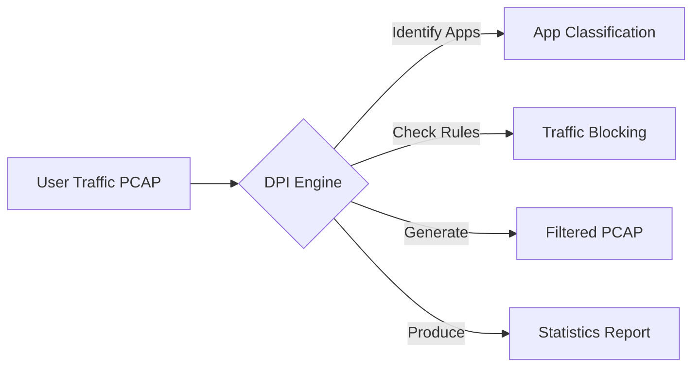
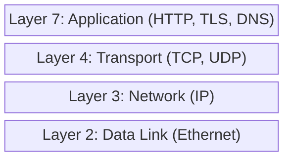
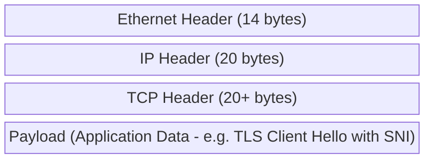
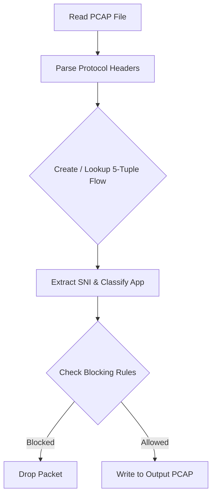
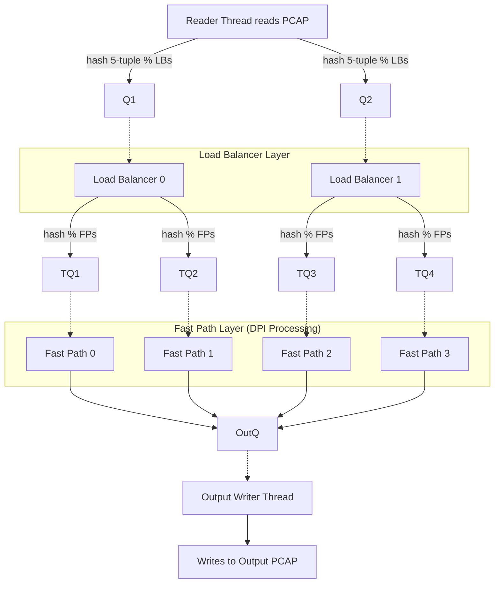
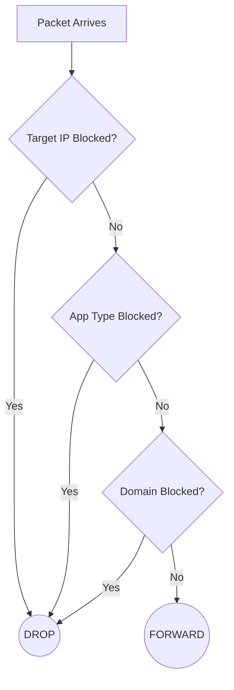

# 🚀 High-Performance Deep Packet Inspection (DPI) Engine

A highly concurrent, multi-threaded C++ DPI engine capable of parsing binary PCAP files, reconstructing the TCP/IP stack, and classifying network traffic by extracting TLS SNI and HTTP Host headers without decrypting payloads.

---

## 📖 Table of Contents
1. [What is DPI?](#-what-is-dpi)
2. [Networking Background](#-networking-background)
3. [Project Architecture](#-project-architecture)
4. [The Journey of a Packet](#-the-journey-of-a-packet)
5. [Multi-Threaded Architecture](#-multi-threaded-architecture)
6. [How SNI Extraction Works](#-how-sni-extraction-works)
7. [How Blocking Works](#-how-blocking-works)
8. [Building and Running](#-building-and-running)

---

## 🔍 What is DPI?

**Deep Packet Inspection (DPI)** is a networking technology used to examine the contents of data packets as they pass through a checkpoint. Unlike standard firewalls that only look at routing headers (IPs and Ports), DPI looks *inside* the packet payload.

### Real-World Use Cases:
- **ISPs**: Throttle or block specific applications (e.g., BitTorrent).
- **Enterprises**: Block social media or unauthorized sites on office networks.
- **Security**: Detect malware signatures or intrusion attempts.

### How Our Engine Works:


---

## 🌐 Networking Background

### The Network Stack (Layers)

Data travels through multiple "layers" over the network. Our DPI engine primarily operates on Layers 3, 4, and 7.



### A Packet's Structure (The "Russian Nesting Doll")

Every network packet contains headers wrapped inside other headers:



### The Five-Tuple connection
A "flow" or connection is uniquely identified by 5 values:
1. **Source IP**: `192.168.1.100`
2. **Destination IP**: `172.217.14.206`
3. **Source Port**: `54321`
4. **Destination Port**: `443` (HTTPS)
5. **Protocol**: `TCP/UDP`

> **Note:** All packets sharing the same 5-tuple belong to the same connection. If we block one packet of a connection, we drop the entire flow based on this tuple.

---

## ⚙️ Project Architecture

We provide two implementations:
1. **Simple (Single-threaded) (`main_working.cpp`)**: Perfect for understanding the core concepts and small packet captures.
2. **Multi-threaded (`dpi_mt.cpp`)**: Enterprise-grade architecture built for high performance on large captures.

### 🗂️ File Structure
```text
packet_analyzer/
├── include/                 # Declarations
│   ├── pcap_reader.h        # PCAP binary file reading
│   ├── packet_parser.h      # L2-L4 protocol parsing
│   ├── sni_extractor.h      # L7 TLS/HTTP inspection
│   ├── rule_manager.h       # Flow blocking rules
│   └── thread_safe_queue.h  # Lock-free core queue
├── src/                     # Implementations
│   ├── main_working.cpp     # ★ SIMPLE VERSION
│   └── dpi_mt.cpp           # ★ MULTI-THREADED VERSION
└── test_dpi.pcap            # Sample traffic
```

---

## 🛤️ The Journey of a Packet (Single-Threaded)



1. **Read PCAP File**: Reads the 24-byte global header and iterating through the 16-byte packet headers.
2. **Parse Headers**: Extracts Ethernet MACs, IPv4 Addresses, TCP Ports, and Payload start.
3. **Create 5-Tuple**: Hashes the connection details to look up the flow state.
4. **Deep Inspection (SNI)**: Parses TLS Client Hello to find unencrypted Server Name Indication (SNI).
5. **Blocking rules**: Checks IP, App Type, and Domain rules to drop or forward.

---

## 🚀 Multi-Threaded Architecture

The multi-threaded version (`dpi_mt.cpp`) achieves high performance using a Producer-Consumer model and Consistent Hashing.



### Why this design?
- **Consistent Hashing**: A connection (5-Tuple) always maps to the *same* Fast Path thread. This guarantees sequential processing for packets of the same flow and eliminates the need for expensive `std::mutex` locks on the flow state tracking tables!
- **Thread-Safe Queues**: Uses condition variables and mutexes internally to avoid busy-looping while passing packets seamlessly between pipeline stages.

---

## 🔐 How SNI Extraction Works

Even though HTTPS encrypts the connection payload, the initial handshake sends the requested domain in plaintext. We extract the Server Name Indication (SNI) right from the TLS Client Hello.

```mermaid
sequenceDiagram
    autonumber
    participant Client
    participant Server

    Client->>Server: TLS Client Hello (SNI: www.youtube.com Plaintext)
    Note over Client, Server: DPI Engine Extracts SNI Here!
    Server-->>Client: TLS Server Hello (Certificate)
    Client->>Server: Key Exchange
    Note over Client, Server: TLS connection established
    Client=>>Server: Encrypted Application Data
```

---

## 🛑 How Blocking Works

We implement **Flow-Based Blocking**. Instead of repeatedly inspecting every payload, we inspect until we find the app signature (usually in the Client Hello). Once blocked, all future packets for that flow are dropped in O(1) time.



---

## 🏗️ Building and Running

### Prerequisites
- macOS, Linux, or Windows (WSL) with a **C++17** compiler (`g++` or `clang++`).
- Completely dependency-free standard library approach (No `libpcap` required!)

### Build Commands

**Build Single-Threaded:**
```bash
g++ -std=c++17 -O2 -I include -o dpi_simple src/main_working.cpp src/pcap_reader.cpp src/packet_parser.cpp src/sni_extractor.cpp src/types.cpp
```

**Build Multi-Threaded:**
```bash
g++ -std=c++17 -pthread -O2 -I include -o dpi_engine src/dpi_mt.cpp src/pcap_reader.cpp src/packet_parser.cpp src/sni_extractor.cpp src/types.cpp
```

### Run & Output
**Basic Filtering:**
```bash
# Multi-threaded with 4 LBs and 4 FPs (16 threads processing)
./dpi_engine test_dpi.pcap output.pcap --block-app YouTube --block-domain facebook --lbs 4 --fps 4
```

Enjoy exploring the depths of packet analysis! 🚀
